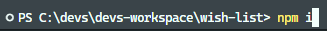
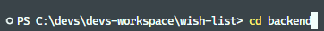
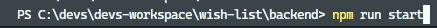

# WishList

This project is the implementation of a wishlist where you can manage your tasks. It has been developed with React using almost all react hooks and react router and SASS for the styles.

You can see it running in:

https://tasks.arcprojects.es

If you want to see the explanation of the project click in the next link:

https://vimeo.com/820704622/24acc3d4e3

\
 

<b><u>For execute it, clone this repository,</u></b>

<code>git clone git@github.com:devs-toni/wishlist.git</code>

 ## Frontend

 <b><u>Introduce in a terminal for installing the dependencies,</u></b>

 \

<code>npm i</code>

<b><u>And when the node dependencies installation is complete,</u></b>

\

<code>npm run start</code> | in the source root to start the frontend section.

## Backend

\

Introduce | <code>cd backend</code> | in your terminal to navigate to this folder in your terminal,

\

And run | <code>npm i</code> | to install the dependencies, and after this,

\

run | <code>npm run start</code> | to start the backend process.

👩‍🚀 I hope you enjoy it!!! 🚀
