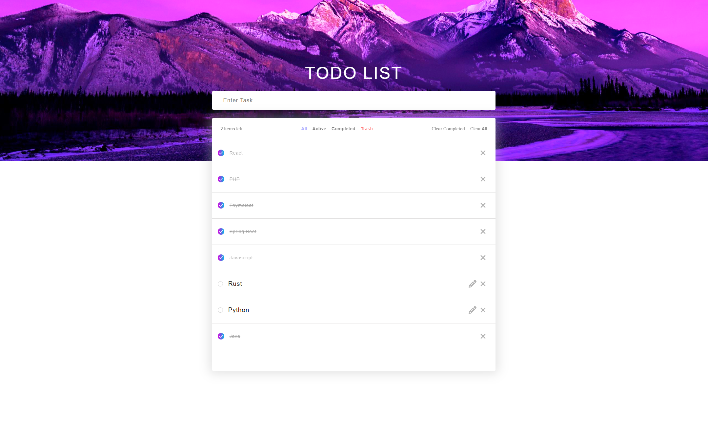

# WishList

This project is the implementation of a wishlist where you can manage your tasks. It has been developed with React using almost all react hooks and react router.

\
 

<b><u>For execute it, clone this repository,</u></b>

<code>git clone git@github.com:devs-toni/wishlist.git</code>

 <b><u>and introduce in a terminal for installing the dependencies,</u></b>

<code>npm i</code>

<b><u>And when the node dependencies installation is complete,</u></b>

<code>npm run start</code>

👩‍🚀 I hope you enjoy it!!! 🚀
